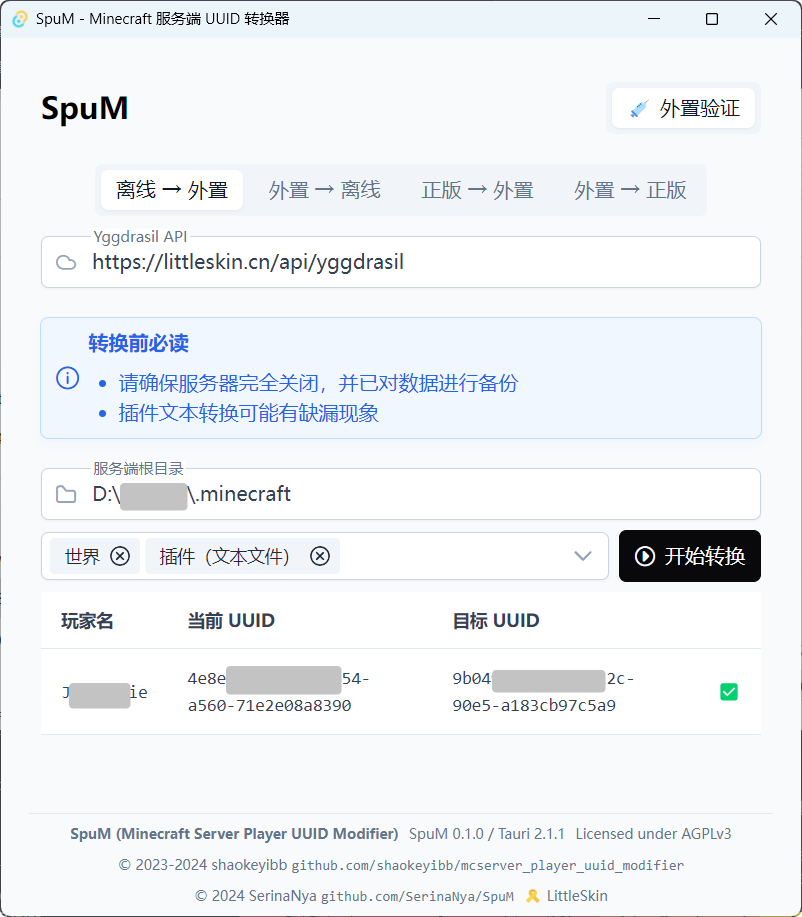

# SpuM
_Minecraft 服务端 UUID 转换器_  
_Minecraft Server Player UUID Modifier_

---

## License

The software is licensed under the [AGPLv3](LICENSE) license.

© 2023-2024 [shaokeyibb/mcserver_player_uuid_modifier](https://github.com/shaokeyibb/mcserver_player_uuid_modifier)  
© 2024 [SerinaNya/SpuM](https://github.com/SerinaNya/SpuM)
